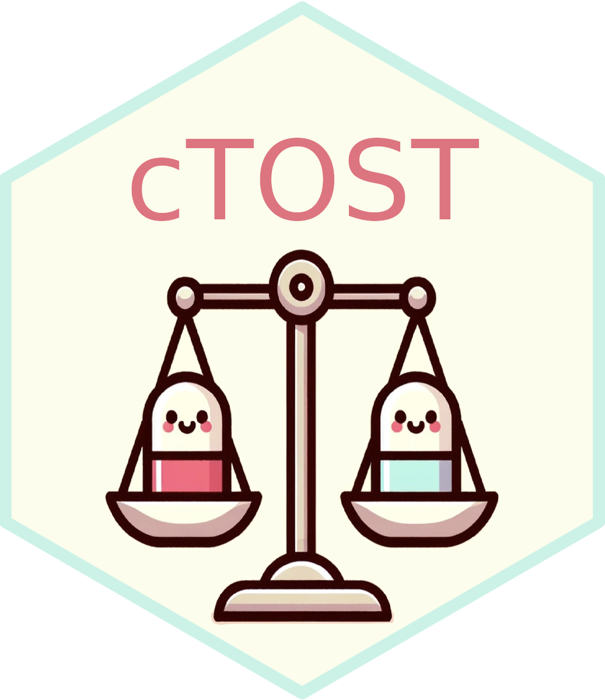

<!-- README.md is generated from README.Rmd. Please edit this file -->

# `cTOST` Overview <a href="https://yboulag.github.io/cTOST/"></a>

<!-- badges: start -->

[](https://opensource.org/license/agpl-v3)
[](https://github.com/yboulag/cTOST)
[](https://github.com/yboulag/cTOST/actions/workflows/R-CMD-check.yaml)
[](https://www.r-pkg.org/pkg/cTOST)
[](https://www.r-pkg.org/pkg/cTOST)
<!-- badges: end -->

## Overview

This repository holds the `cTOST` R package. This package contains the
function `tost` which provides an assessment of equivalence in the
univariate framework based on the state-of-the-art Two One-Sided Tests
(TOST). In addition, the package contains the functions `atost` and
`dtost`, two corrective procedures applied to the TOST in the univariate
framework in order to ensure the preservation of the Type I error rate
at the desired nominal level and a uniform increase in power. These two
functions output an assessment of equivalence in the univariate
framework after their respective corrections is applied. More details
can be found in Boulaguiem et al. (2024) that you can access via this
[link](https://doi.org/10.1002/sim.9993).

## Install Instructions

The `cTOST` package is available on both CRAN and GitHub. The CRAN
version is considered stable, whereas the GitHub version is subject to
modifications/updates which may lead to installation problems or broken
functions. You can install the stable version of the `cTOST` package
with:

``` r
install.packages("cTOST")
```

In order to install the latest version from GitHub, it is required to
pre-install the `devtools` dependency. Run the following command if you
do not have it already installed:

``` r
install.packages("devtools")
```

The package is then installed with the following command:

``` r
devtools::install_github("yboulag/cTOST")
```

Note that Windows users are assumed to have Rtools installed (if this is
not the case, please visit this
[link](https://cran.r-project.org/bin/windows/Rtools/)).

## How to cite

    @Manual{boulaguiem2023ctost,
      title = {cTOST: Finite Sample Correction of The TOST in The Univariate Framework},
      author = {Younes Boulaguiem and Stéphane Guerrier and Dominique-Laurent Couturier},
      year = {2023},
      note = {R package version 1.0.1},
      url = {https://github.com/yboulag/cTOST},
    }

## License

The license this source code is released under is the GNU AFFERO GENERAL
PUBLIC LICENSE (AGPL) v3.0. Please see the LICENSE file for full text.
Otherwise, please consult
[GNU](https://www.gnu.org/licenses/agpl-3.0.en.html) which will provide
a synopsis of the restrictions placed upon the code.

## References

Boulaguiem, Y., Quartier, J., Lapteva, M., Kalia, Y. N., Victoria-Feser,
M. P., Guerrier, S., & Couturier, D. L., “*Finite Sample Adjustments for
Average Equivalence Testing*”, Statistics in Medicine, 2024,
<https://doi.org/10.1002/sim.9993>.
