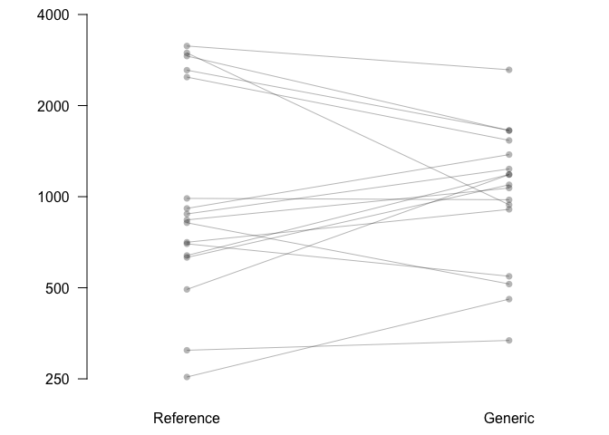
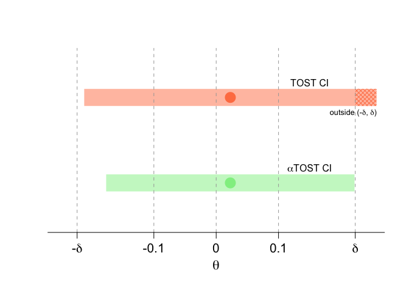

<!-- README.md is generated from README.Rmd. Please edit this file -->

[](https://github.com/yboulag/cTOST/actions)

# `cTOST` Overview

This repository holds the `cTOST` R package. This package contains a
function of the same name, `cTOST`, that provides an assessment of
equivalence in the univariate framework. This assessment is based on the
state-of-the-art Two One-Sided Tests (TOST), and a corrective procedure
applied to the TOST in order to ensure the preservation of the Type I
error rate at the desired significance level and a uniform increase in
power. More details can be found in Boulaguiem et al. (2023) that you
can access via this
[link](https://www.biorxiv.org/content/10.1101/2023.03.11.532179v2.full)

# Install Instructions

The `cTOST` package is only available on GitHub at the moment. It is
subject to ongoing updates that may lead to stability issues.

In order to install the package, it is required to pre-install the
`devtools` dependency. Run the following command if you do not have it
already installed:

``` r
install.packages("devtools")
```

The package is then installed with the following command:

``` r
devtools::install_github("cTOST")
```

# Equivalence Assessment

In order the demonstrate the use of the function `cTOST`, we will use it
on a dataset provided in the package. The dataset, provided by Quartier
et al. (2019), contains 17 pairs of comparable porcine skin samples on
which measurements of econazole nitrate deposition (an antifungal
medication used to treat skin infections) were collected using two
(supposedly) bioequivalent products. These measurements were then
considered on the logarithmic scale and saved as an RData file called
`skin`.

After installing the package, you can simply print the dataset by
running `skin` on your console (the dataset has been lazy loaded into
the package).

``` r
head(skin)
#>       Reference  Generic
#> Obs.1  5.739053 5.813981
#> Obs.2  6.560818 6.811332
#> Obs.3  6.731042 6.973451
#> Obs.4  5.535548 6.128285
#> Obs.5  6.548992 6.301647
#> Obs.6  6.445193 6.998245
```

The following code allows to reproduce Figure 1 of Boulaguiem et
al. (2023):

``` r
par(mar=c(2.5,5,0,0))
plot(1,1,pch="",axes=FALSE,xlab="",ylab="",main="",
     ylim=c(min(unlist(skin)),log(4000)),xlim=c(0.75, 2.25))
for(i in 1:nrow(skin)){
  points(c(1,2),skin[i,],col=paste0(gray(0.1),50),pch=16)
  segments(1,skin[i,1],2,skin[i,2],
           col=paste0(gray(0.1),50))
}
axis(1, at = c(1,2), c("Reference", "Generic"),tick=FALSE)
axis(2, at = log(c(250,500,1000,2000,4000)), c(250,500,1000,2000,4000), las=2)
axis(2, at = mean(c(min(unlist(skin)),log(4000))), "ECZ deposition (ng/cm^2)",padj=-4.5, tick = FALSE)
```



Let us now extract from the dataset the components needed to run the
`cTOST` function. We would need the difference of means between the two
groups, the number of degrees of freedom, and the standard error:

``` r
theta <- diff(apply(skin,2,mean)) # The difference of means between the two groups
nu <- nrow(skin)-1 # The number of degrees of freedom
sigma_nu <- sd(apply(skin,1,diff))/sqrt(nu) # The standard error
```

Considering a significance level of 5% and an equivalence limit at
delta = *l**o**g*(1.25), the cTOST function is used as follows:

``` r
alpha <- 0.05
delta <- log(1.25)
cTOST(alpha=alpha, theta=theta, sigma_nu=sigma_nu, nu=nu, delta=delta)
#>        theta sigma_nu  Level CI - low. CI - up.  delta Decision
#> TOST  0.0227   0.1343 0.0500   -0.2117   0.2571 0.2231        0
#> cTOST 0.0227   0.1343 0.0787   -0.1765   0.2219 0.2231        1
```

To visually assess equivalence with the interval inclusion principal, we
reproduce Figure 2 of Boulaguiem et al. (2023) with the following code:

``` r
plot(NA, axes = F, xlim = c(-0.25, 0.25), ylim = c(0.5, 2.5),
     xlab = " ", ylab = " ")

a1 = theta + sigma_nu*qt(alpha, df = nu)
a2 = theta - sigma_nu*qt(alpha, df = nu)

cols=c("coral","palegreen2")
t.cols=sapply(c("coral","palegreen2"),function(x){
  rgb.val <- col2rgb(x)
  rgb(rgb.val[1], rgb.val[2], rgb.val[3],
      max = 255,
      alpha = 127.5)
})
d = 0.1
polygon(c(a1, a2, a2, a1), c(1-d, 1-d, 1+d, 1+d) + 1, border = NA,
        col = t.cols[1])

polygon(c(delta, a2, a2, delta), c(1-d, 1-d, 1+d, 1+d) + 1, border = NA,
        col = cols[1], density = 20, angle = 45)
polygon(c(delta, a2, a2, delta), c(1-d, 1-d, 1+d, 1+d) + 1, border = NA,
        col = cols[1], density = 20, angle = -45)

alpha_star = cTOST(alpha=alpha, theta=theta, sigma_nu=sigma_nu, nu=nu, delta=delta)[2,3]

b1 = theta + sigma_nu*qt(alpha_star, df = nu)
b2 = theta - sigma_nu*qt(alpha_star, df = nu)

polygon(c(b1, b2, b2, b1), c(1-d, 1-d, 1+d, 1+d), border = NA,
        col = t.cols[2])

points(theta, 2, col = cols[1], pch = 16, cex = 2.5)
points(theta, 1, col = cols[2], pch = 16, cex = 2.5)

text(0.15, 2 + 1.75*d, "TOST CI")
text(0.15, 1 + 1.75*d, expression(paste(alpha,"TOST CI")))

text(0.22, 2 - 1.75*d, "Outside (-c, c)", cex = 0.8)
abline(v = c(-0.3, -log(1.25), -0.1, 0, 0.1, log(1.25), 0.3),
       col = "grey65", lty = 2)
axis(1, at = c(-0.3, -log(1.25), -0.1, 0, 0.1, log(1.25), 0.3),
     labels = c("-0.3", expression(paste("-",delta)), "-0.1", "0", "0.1",
                expression(delta), "0.3"),padj=-0.15,cex.axis=1.3)
mtext(expression(theta), side = 1, line = 2.35, cex = 1.4)
```



# Referencess

Papier Quartier et Papier Boulaguiem. Use bibtex
